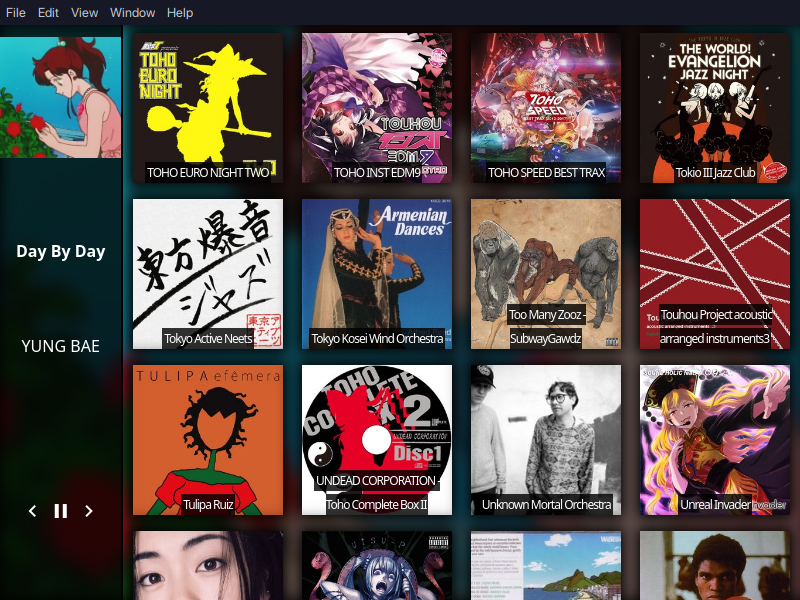

mpdec
=====

Electron-based mpd client

*Goals*:

 - [ ] Css Themeable UI
 - [x] Libnotify integration
 - [ ] Main navigation is album-based
 - [ ] Not DIRECTLY dependant on MPD (by using an extra abstraction layer)

*Maybes*:

 - [ ] Unit tested?
 - [ ] MPRIS Support?
 - [ ] Tag editor?

*Non-Goals*:

 - Fully Fledgeg Music Player 
